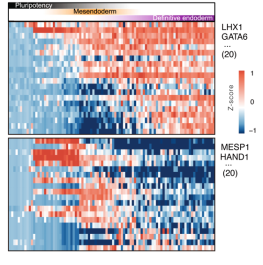

# BSfate: a computed method for decoding the bistable genetic switch circuits that control cell fate decisions from single-cell RNA-seq data

BSfate is a bistable switch circuits prediction method for directional single-cell RNA-seq data. It is written in R language (R >= 4.2.1).

BSfate takes a scRNA-seq dataset from the directional differentiation process as input. First, pseudo-time information of cells can be obtained through trajectory inference methods such as slingshot. BSFate models the gene expression as a nonlinear function of pseudo-time and utilizes a nonlinear least squares method to screen TFs that display switch-like or transient activation patterns. By combinatorically paired, BSFate forms candidate gene pairs and calculates the significance score for each candidate. The pairs with the top rank are anticipated to constitute the core cell fate circuits. Meanwhile, TFs can be ordered based on the most prominent rank of their respective gene pairs for further investigation or experimental validation.


The TFs can be used to estimate single-cell differentiation potency.

The innovation of BSfate is adopting a theory-driven research paradigm, where the computational method is inspired by quantitative mathematical modeling. BSFate considers the bistable gene circuit as an integrated system and identifies TF pairs whose temporal expression dynamics align with the theoretical model.


Our benchmark testing on simulated and real experimental datasets has shown that BSFate consistently outperforms baseline methods in identifying the known driver regulators of cell fate decisions.

BSFate shows a significant application in investigating the regulatory mechanisms underlying the directed differentiation of embryonic stem cells, and it holds the potential for broader applications in understanding a wide range of cell fate determination processes.

## **Installation**
We recommend installing the CytoTRACE 2 package using the devtools package from the R console. If you do not have devtools installed, you can install it by running install.packages("devtools") in the R console.

devtools::install_github("SDU-W-Zhanglab/BSfate")
library(BSfate)

## **Running** **BSfate**
Running BSfate is very simple, after loading the library, it only takes four steps to complete the prediction of cell fate determinants:

1.Obtain TF gene expression matrix and pseudo-time

2.Screen TFs that display switch-like or transient activation patterns

3.Calculate the significance scores of the candidate cell fate determinants

4.Order cell fate determinants by significance scores

The following shows specific applications on simulated data and two sets of real data.

- Simulated DATASET

The switch gene and transient gene of simulated data are used as known data here because of the simple branching of simulated data. Below, we will take Astrocyte lineage as an example.


```
# Astrocyte lineage

###step 1 and step 2 Known data acquisition
data(astrocyte)
astrocyte_exprs = t(as.matrix(astrocyte))
Switch__TF=c("Hes5","Scl","Stat3","Aldh1L")
Transient_TF=c("Mash1","Zic1","Brn2","Tuj1","Olig2","Myt1L","Sox8")

###step 3 Calculate the significance scores
SignificanceScore=get_SignificanceScore(astrocyte_exprs,Switch__TF,Transient_TF,0)

###step 4 Order cell fate determinants
BSfate_TFs=get_singleTF_BSfate_rank(SignificanceScore)

```
The following is the presentation of TF's significance score results and performance


- hESC DATASET
```
###step 1 Known data acquisition
data(scExp_hESC)
data(pesudo_hESC)
data(TF_human)
TF_Human=(TF_human)[,1]
scExp_hESC_TF=scExp_hESC[intersect(rownames(scExp_hESC),TF_Human),order(pesudo_hESC[,1],decreasing = F)]

###step 2 Screem candidate cell fate determinants
Switch_test_hESC=Switch_nls(scExp_hESC_TF)
Tansient_test_hESC=Tansient_nls(scExp_hESC_TF)
Pro_screen_TFs=Screen_TF(Switch_test_hESC,Tansient_test_hESC,top_n=20)
```



```
####step 3 Calculate the significance scores
SignificanceScore=get_SignificanceScore(scExp_hESC_TF,Hs_switch_n,Hs_transient_n,0.1)

####step 4 Order cell fate determinants
BSfate_TFs=get_singleTF_BSfate_rank(SignificanceScore)
```


```
Following are comparison of BSFate with Monocle3-DE, tradeSeq, ImpulseDE2, and scFates, on astrocyte branch. The precision is plotted as a function of the number of top-ranked genes involved in the four ground truth gene sets. And the prioritization of driver regulators predicted by BSFate. TFs are sorted in descending order according to their significance sores. When TFs are annotated within the ground truth sets, they are connected.
```


## **Input** **files**

BSfate requires a single-cell RNA-sequencing gene expression object as input. This can include raw counts, as well as normalized counts, as long as normalization preserves ranking of input gene values within a cell. The gene expression matrix takes the following form.


## **Output**

The output of BSfate is TFs and significance score ranking.


## **Authors**

BSfate was developed in the Zhang lab by Naiqian Zhang,Wenchao Xiu,Yong Zhang,Yumiao Hou,Junchao Wang.
## **Contact**

If you have any questions, please contact the BSfate team at nqzhang@email.sdu.edu.cn

## **Funding**

This work has been supported by the National Natural Science Foundation of China [62072277].
